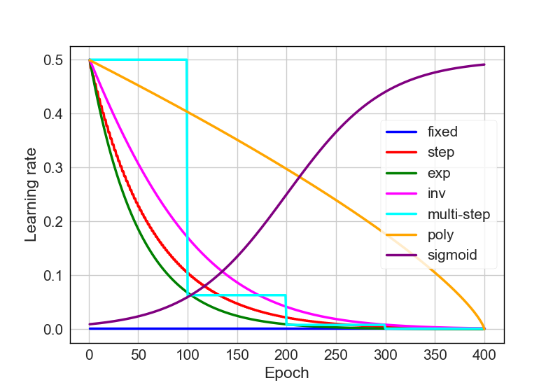

# Comparisons of different learning rate policy in Caffe
---

## Principle
1. fixed: $lr_{iter} = lr_{base}$

2. step: $lr_{iter} = lr_{base}*\gamma^{floor(\frac{iter}{step})}$

3. exp: $lr_{iter} = lr_{base}*\gamma^{iter}$

4. inv: $lr_{iter} =  lr_{base}*(1+\gamma*iter)^{-power}$

5. multi\_step: $lr_{iter} = lr_{base}*\gamma$, where $\gamma$ is decided by pre-defined steps.

6. poly: $lr_{iter} = lr_{base}*(1-\frac{iter}{maxIter})^{power}$

7. sigmoid: $lr_{iter} = lr_{base}*\frac{1}{1+e^{-\gamma*(iter-step)}}$

## Comparisons

